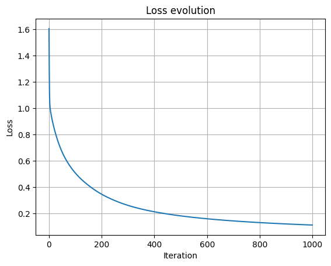

# Neural-Network-From-Scratch

## Project description

First implementation of NN from scratch (without any Deep learning framework such as Pytorch) to predict the Iris variety based on physical aspects features. This project includes model training, data cleaning and comprehensive visualization. The goal of the manual implementation is to deepen my understanding of NN.
It was also made to demonstrate my understanding of:
- Fordward propagation
- Backward propagation
- gradient derivation
- softmax and cross-entropy loss for multi-classification
- training with gradient descent
- features normalization and data spliting

## Model Architecture
Input (n_features)
      ↓
Linear layer (W1, b1)
      ↓
ReLU activation
      ↓
Linear layer (W2, b2)
      ↓
Softmax
      ↓
Cross-entropy Loss

Parameters dimensions:
- W1 : (n_features,64)
- b1 : (1,64)
- W2 : (64,3)
- b1 : (1,3)

## Key Features
- Fully manual implementation(forward + backward propagation)
- gradient calculation using matrix calculus
- Multi-class softmax + cross entropy
- Features normalization
- Train/Validation/Test data spliting
- Accuracy computation
- Only numpy framework

## Results
- Get an accuracy of 96.67% at the end of the optimization of the weight and bias.

